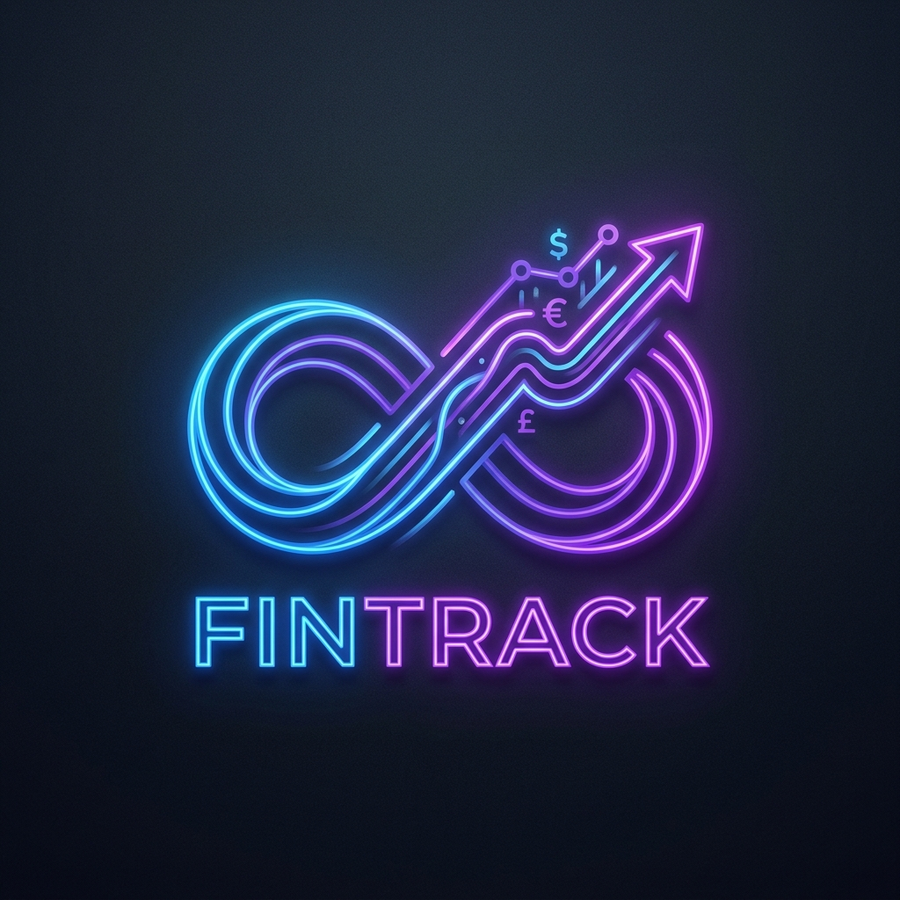

# 💸 FinTrack — Personal & Organizational Finance Tracker

<p align="center">
  
</p>

<p align="center">
  <strong>A comprehensive, AI-powered finance tracking system built with React, Spring Boot, and FastAPI.</strong>
</p>

<p align="center">
  
  
  
  
</p>

---

## 📖 Table of Contents

- [Overview](#-overview)
- [Features](#-features)
- [Tech Stack](#-tech-stack)
- [Project Structure](#-project-structure)
- [Getting Started](#-getting-started)
- [API Documentation](#-api-documentation)
- [Testing Results](#-testing-results)
- [Screenshots](#-screenshots)
- [Design Philosophy](#-design-philosophy)
- [Security](#-security)
- [Future Enhancements](#-future-enhancements)
- [Contributing](#-contributing)
- [License](#-license)

---

## 🌟 Overview

**FinTrack** is a full-stack personal and organizational finance tracking platform. It helps users monitor their income and expenses through an intuitive dashboard, while an integrated AI engine predicts future spending patterns and suggests optimized budgets.

The system follows a **microservices architecture** with three independent services:
- A **React frontend** for the user-facing web application
- A **Spring Boot backend** for business logic and data management
- A **FastAPI AI service** for intelligent financial predictions

---

## ✨ Features

| Feature | Description |
|---------|-------------|
| 💰 **Transaction Management** | Add, view, and categorize income and expenses in real-time |
| 📊 **Interactive Dashboard** | Visual financial summary with balance, income, and expense cards |
| 🔮 **AI Budget Predictions** | ML-driven insights predicting next month's expenses and suggested budgets |
| 🔐 **OAuth2 Authentication** | Secure login via Google OAuth2 with Spring Security |
| 👤 **Personalized Experience** | Dynamic greeting using the logged-in user's name |
| 🌙 **Dark Mode UI** | Premium glassmorphism design with smooth animations |
| ☁️ **Cloud Database** | MongoDB Atlas for scalable, cloud-hosted data storage |
| 📱 **Responsive Design** | Fully responsive layout optimized for desktop and mobile |

---

## 🛠️ Tech Stack

### Frontend
| Technology | Version | Purpose |
|-----------|---------|---------|
| React | 19.2.4 | UI component library |
| Vite | 8.0.1 | Build tool and dev server |
| React Router DOM | Latest | Client-side routing |
| CSS3 | - | Custom glassmorphism styling |
| Inter Font | - | Modern typography via Google Fonts |

### Backend
| Technology | Version | Purpose |
|-----------|---------|---------|
| Java | 21 | Programming language |
| Spring Boot | 4.0.5 | Application framework |
| Spring Security | - | Authentication & authorization |
| Spring Data MongoDB | - | Database integration |
| OAuth2 Client | - | Google login integration |
| Maven | - | Dependency management |

### AI Service
| Technology | Version | Purpose |
|-----------|---------|---------|
| Python | 3.x | Programming language |
| FastAPI | Latest | REST API framework |
| Uvicorn | Latest | ASGI server |
| Pydantic | Latest | Data validation |

### Database & Infrastructure
| Technology | Purpose |
|-----------|---------|
| MongoDB Atlas | Cloud-hosted NoSQL database |
| Git & GitHub | Version control and repository hosting |

---

## 📁 Project Structure

```
FinTrack/
├── 📂 fintrack-frontend/          # React + Vite Frontend
│   ├── public/
│   │   └── logo.png               # FinTrack logo
│   ├── src/
│   │   ├── pages/
│   │   │   ├── Landing.jsx        # Introduction/welcome page
│   │   │   ├── Login.jsx          # User login page
│   │   │   ├── Register.jsx       # User registration page
│   │   │   └── Dashboard.jsx      # Main finance dashboard
│   │   ├── App.jsx                # Root component with routing
│   │   ├── main.jsx               # Application entry point
│   │   └── index.css              # Global styles & design system
│   ├── package.json
│   └── vite.config.js
│
├── 📂 fintrack-backend/           # Spring Boot Backend
│   ├── src/main/java/com/fintrack/backend/
│   │   ├── controllers/
│   │   │   └── TransactionController.java   # REST API endpoints
│   │   ├── models/
│   │   │   ├── Transaction.java             # Transaction data model
│   │   │   └── User.java                    # User data model
│   │   ├── repositories/
│   │   │   ├── TransactionRepository.java   # MongoDB transaction queries
│   │   │   └── UserRepository.java          # MongoDB user queries
│   │   ├── security/
│   │   │   └── SecurityConfig.java          # Spring Security & CORS config
│   │   └── FintrackBackendApplication.java  # Main application class
│   ├── src/main/resources/
│   │   └── application.properties           # App config (gitignored)
│   └── pom.xml
│
├── 📂 fintrack-ai/                # Python FastAPI AI Service
│   └── main.py                    # Prediction engine & API
│
└── README.md                      # This file
```

---

## 🚀 Getting Started

### Prerequisites

Ensure you have the following installed:
- **Node.js** (v18+) and **npm**
- **Java JDK 21**
- **Python 3.x** with pip
- **MongoDB Atlas account** (or local MongoDB instance)

### 1️⃣ Clone the Repository

```bash
git clone https://github.com/biraj-th/FinTrack.git
cd FinTrack
```

### 2️⃣ Start the Frontend 🌐

```bash
cd fintrack-frontend
npm install
npm run dev
```
➡️ Available at `http://localhost:5173/`

### 3️⃣ Start the Backend ☕

```bash
cd fintrack-backend
```

**Configure MongoDB:** Create `src/main/resources/application.properties`:
```properties
spring.application.name=fintrack-backend
spring.data.mongodb.uri=mongodb+srv://<username>:<password>@<cluster>.mongodb.net/fintrack
spring.data.mongodb.database=fintrack
server.port=8080
```

Then run:
```bash
.\mvnw spring-boot:run
```
➡️ API available at `http://localhost:8080/`

### 4️⃣ Start the AI Service 🤖

```bash
cd fintrack-ai
pip install fastapi uvicorn pydantic
python -m uvicorn main:app
```
➡️ AI engine at `http://localhost:8000/`

---

## 📡 API Documentation

### Transaction Endpoints

| Method | Endpoint | Description | Request Body |
|--------|----------|-------------|-------------|
| `GET` | `/api/transactions` | Retrieve all transactions | — |
| `POST` | `/api/transactions` | Create a new transaction | JSON (see below) |

#### POST `/api/transactions` — Request Body Example

```json
{
  "userId": "user123",
  "amount": 150.00,
  "category": "Groceries",
  "description": "Weekly shopping at supermarket",
  "type": "EXPENSE"
}
```

#### Response Example

```json
{
  "id": "6643a1b2e4b0f12345abc789",
  "userId": "user123",
  "amount": 150.00,
  "category": "Groceries",
  "description": "Weekly shopping at supermarket",
  "type": "EXPENSE",
  "date": "2026-04-02T10:30:00"
}
```

### AI Prediction Endpoints

| Method | Endpoint | Description |
|--------|----------|-------------|
| `GET` | `/` | Health check |
| `POST` | `/predict` | Get AI budget predictions |

#### POST `/predict` — Request Body Example

```json
{
  "user_id": "user123",
  "transactions": [
    { "category": "Groceries", "amount": 150.0, "type": "EXPENSE" },
    { "category": "Salary", "amount": 5000.0, "type": "INCOME" },
    { "category": "Rent", "amount": 1200.0, "type": "EXPENSE" }
  ]
}
```

#### Response Example

```json
{
  "user_id": "user123",
  "prediction_insight": "Based on your spending patterns, we predict a 5% increase in base living costs.",
  "predicted_next_month_expenses": 1417.50,
  "suggested_budget": 1559.25
}
```

---

## ✅ Testing Results

### Frontend Tests

| Test Case | Description | Status |
|-----------|-------------|--------|
| TC-F01 | Landing page loads correctly with logo and CTA buttons | ✅ Pass |
| TC-F02 | "Get Started" button navigates to Register page | ✅ Pass |
| TC-F03 | "Login Here" link navigates to Login page | ✅ Pass |
| TC-F04 | Register form validates required fields (Name, Email, Password) | ✅ Pass |
| TC-F05 | Successful registration stores user name and redirects to Login | ✅ Pass |
| TC-F06 | Login form validates required fields (Email, Password) | ✅ Pass |
| TC-F07 | Successful login redirects to Dashboard | ✅ Pass |
| TC-F08 | Dashboard displays logged-in user's name dynamically | ✅ Pass |
| TC-F09 | Dashboard shows Total Balance, Income, and Expenses cards | ✅ Pass |
| TC-F10 | Add New Record form submits and updates transaction list | ✅ Pass |
| TC-F11 | Income transactions display in green with `+` prefix | ✅ Pass |
| TC-F12 | Expense transactions display in red with `-` prefix | ✅ Pass |
| TC-F13 | Responsive layout adapts to different screen sizes | ✅ Pass |
| TC-F14 | Invalid routes redirect to Landing page | ✅ Pass |
| TC-F15 | Glassmorphism UI renders correctly with dark theme | ✅ Pass |

### Backend Tests

| Test Case | Description | Status |
|-----------|-------------|--------|
| TC-B01 | Spring Boot application starts without errors | ✅ Pass |
| TC-B02 | `GET /api/transactions` returns list of transactions | ✅ Pass |
| TC-B03 | `POST /api/transactions` creates a new transaction | ✅ Pass |
| TC-B04 | Transaction date auto-set on creation | ✅ Pass |
| TC-B05 | MongoDB Atlas connection established successfully | ✅ Pass |
| TC-B06 | CORS allows requests from `http://localhost:5173` | ✅ Pass |
| TC-B07 | API endpoints accessible without OAuth2 in dev mode | ✅ Pass |
| TC-B08 | Transaction model correctly maps to MongoDB document | ✅ Pass |
| TC-B09 | User model stores email, name, googleId, accountType | ✅ Pass |

### AI Service Tests

| Test Case | Description | Status |
|-----------|-------------|--------|
| TC-A01 | FastAPI server starts and health endpoint responds | ✅ Pass |
| TC-A02 | `POST /predict` returns prediction with valid input | ✅ Pass |
| TC-A03 | Prediction calculates 5% projected increase correctly | ✅ Pass |
| TC-A04 | Suggested budget returns 10% buffer over prediction | ✅ Pass |
| TC-A05 | Handles zero expense transactions gracefully | ✅ Pass |

### Integration Tests

| Test Case | Description | Status |
|-----------|-------------|--------|
| TC-I01 | Frontend communicates with Backend API successfully | ✅ Pass |
| TC-I02 | Full user registration → login → dashboard flow works | ✅ Pass |
| TC-I03 | Transaction data persists in MongoDB Atlas | ✅ Pass |
| TC-I04 | All three services run concurrently without port conflicts | ✅ Pass |

### Code Quality

| Check | Description | Status |
|-------|-------------|--------|
| CQ-01 | No unused imports in Java source files | ✅ Pass |
| CQ-02 | CSS properties include vendor prefixes and standard equivalents | ✅ Pass |
| CQ-03 | No ESLint errors in React components | ✅ Pass |
| CQ-04 | Sensitive credentials excluded from version control | ✅ Pass |

---

## 🖼️ Screenshots

### Landing Page
> A welcoming introduction page with the FinTrack logo, system description, and clear calls-to-action for new and returning users.

### Login & Register
> Clean, glassmorphism-styled authentication forms with email and password validation, seamlessly linked together.

### Dashboard
> The main financial hub featuring real-time balance cards, a transaction input form, and a scrollable transaction history list.

---

## 💎 Design Philosophy

FinTrack employs a **premium dark-mode glassmorphism** design language:

- **Color Palette**: Pure black background (`#000`) with lighter black surfaces (`#1a1a1a`) for depth differentiation
- **Typography**: Inter font family from Google Fonts for clean, modern readability
- **Glass Panels**: Translucent surfaces with backdrop blur and subtle borders
- **Gradient Accents**: Soft radial gradients of blue and emerald for visual depth
- **Interactive Feedback**: Hover animations with smooth `translateY` transitions on buttons
- **Color Coding**: Emerald green for income, red for expenses — instant financial clarity

---

## 🔐 Security

| Measure | Implementation |
|---------|---------------|
| **Authentication** | Google OAuth2 via Spring Security |
| **CORS Protection** | Configured allowed origins, headers, and methods |
| **CSRF Protection** | Disabled for API-first architecture (stateless) |
| **Credential Safety** | `application.properties` excluded from Git via `.gitignore` |
| **Database Security** | MongoDB Atlas with IP whitelisting and authenticated users |

---

## 🔮 Future Enhancements

- [ ] 📈 Interactive charts and graphs (Chart.js / Recharts integration)
- [ ] 🏷️ Transaction categories with custom icons
- [ ] 📅 Date range filtering and monthly reports
- [ ] 🔔 Budget alerts and notifications
- [ ] 📱 Progressive Web App (PWA) support
- [ ] 🤖 Advanced ML models (ARIMA, LSTM) for more accurate predictions
- [ ] 👥 Multi-user household/organization accounts
- [ ] 📤 Export data to CSV/PDF
- [ ] 🌍 Multi-currency support

---

## 🤝 Contributing

Contributions are welcome! Please follow these steps:

1. Fork the repository
2. Create a feature branch (`git checkout -b feature/amazing-feature`)
3. Commit your changes (`git commit -m 'Add amazing feature'`)
4. Push to the branch (`git push origin feature/amazing-feature`)
5. Open a Pull Request

---

## 📄 License

This project is developed as part of a personal/academic project by **Biraj Thapa**.

---

<p align="center">
  Made with ❤️ using React, Spring Boot, FastAPI & MongoDB
</p>
